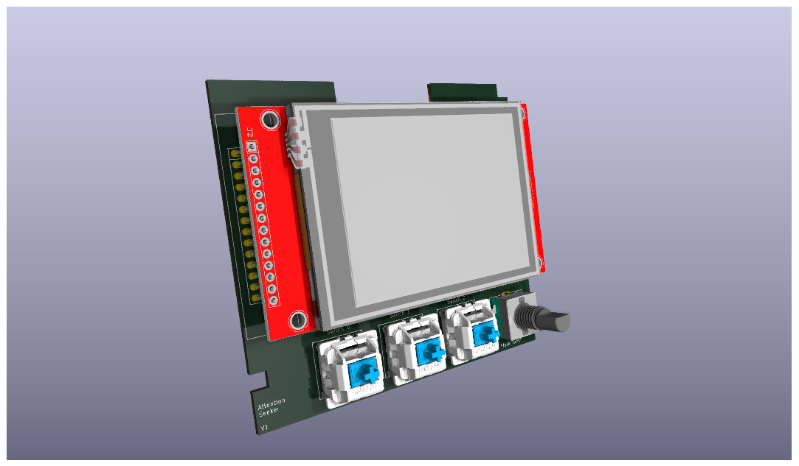
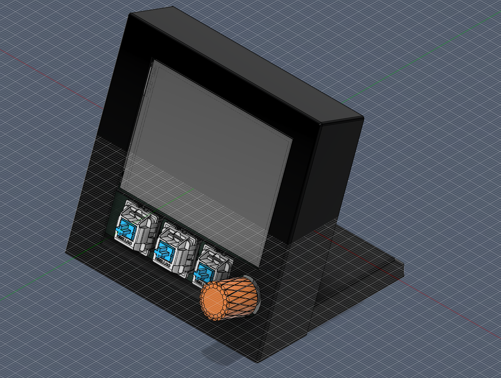

# Attention-Seeker
# Overview
Yet another desk accessory, but this time it is specialized for alerting you. 

It acts as a: 
- clock, timer and alarm
- desk light (dimmable)
- macropad
- notification bay

 

### Why?
I kept missing important notifications when zoning out or concentrating and also needed a desk light, so I built this.

### How?
- 2.8" TFT Screen
- 3 keyboard switches
- Rotary encoder 
- Rigid LED filament
- Buzzer
- Esp32 s3 DevKitC
- Python companion app to run alongside on pc

### Examples
- You get a notification -> Attention-Seeker buzzes and or blinks to show you the contents of the notification
- You need a reminder in X minutes -> It alerts you after X minutes
- You need a light -> It has one

# Features
## Notifications
Alerts you to new notifications, via buzzing and blinking and shows you its details.
These are sent via the companion app.

## Clock
- Time
- Timer
- Alarm
- Synced via companion

## Navigation
- Kbd Switches for on page actions
- Rotary encoder turning for switching pages

## Other
- Dimmable light
- Buzzer

# Hardware
## MCU
The ESP32-S3 might be overkill, but it is a good fit for the number of pixels on the screen, allowing us to quickly switch pages.
Almost all pins are used as the SPI interface of the screen already takes the majority of pins.

## (Back)Light
As both lights draw far more current than the GPIO of the MCU can reliably handle, transistors and an LDO are needed.

### LED filament
The 3V filament draws about 100mA, so another 5V to 3.3V LDO is needed to drive it.
Then an N-channel MOSFET drives the negative side of the LED filament.

### Backlight
When creating the PCB, I didn't know how much current the backlight would draw,
so I also placed a transistor between it and the MCU to be safe.
This transistor is pulled High and can only be pulled down by the MCU.

## Other
The other hardware is directly hooked up to the MCU

# Assembly
See [assembly guide](assembly.md)

# Stuff to do
## Embedded software
None yet

## Companion app
There is also currently neither a linux/kde or windows companion app.