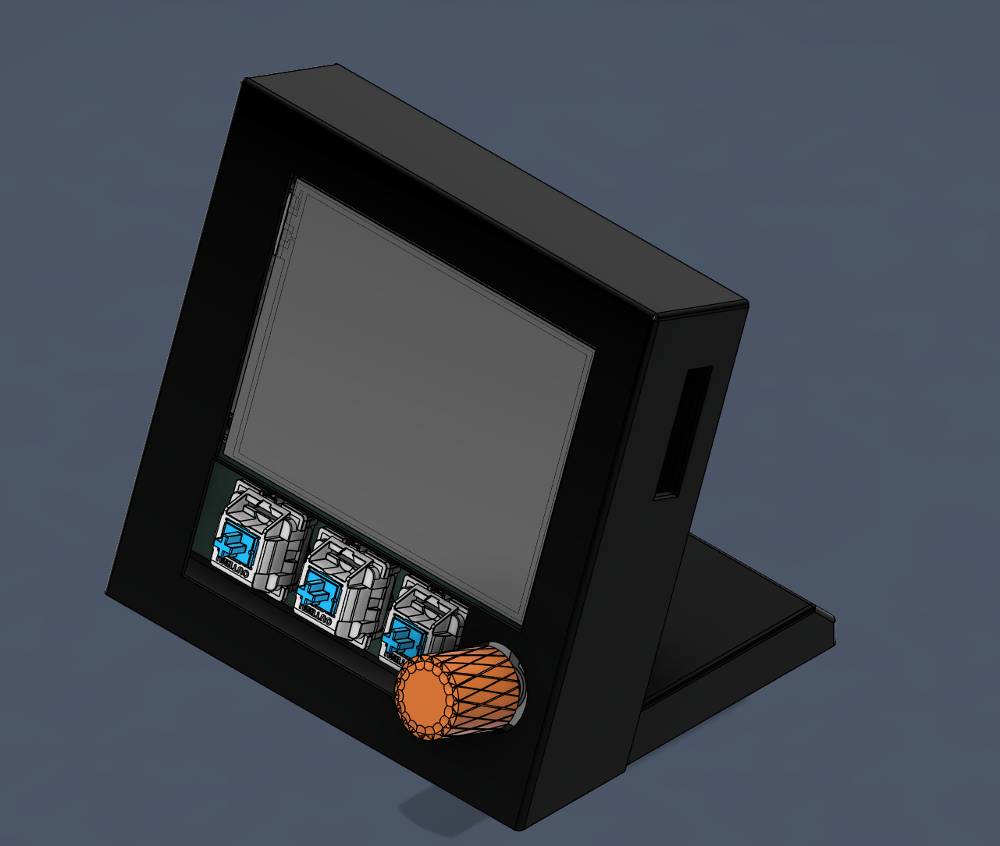

# Attention-Seeker
## Overview
A multifunctional desk peripheral designed to display and alert you to notifications.

Attention-Seeker receives notifications from a companion app and displays them on its 2.8" color screen, with optional visual and audible alerts. It also features a rotary encoder and three mechanical keyboard switches for user input (no touch!).

In addition to notification-related features, it functions as a **clock**, **alarm**, **timer**, **desk light**, and **macropad**.

 

### Why?
I often missed important notifications while zoning out or concentrating and also needed a desk light, so I built this.

### How?
- 2.8" TFT screen
- 3 mechanical keyboard switches
- Rotary encoder
- Rigid LED filament
- Buzzer
- ESP32-S3 DevKitC N16R8 CP2102
- Python companion app to run on a PC

### Example Use Cases
- **Notification:** Attention-Seeker buzzes, blinks, and displays the message.
- **Reminder:** Set a timer for X minutes, and it alerts you when time is up.
- **Desk Light:** Toggle and dim the built-in LED for illumination.

## Features

### Notifications
Displays incoming notifications sent by the companion app with optional blinking or buzzing.

### Clock
- Displays time
- Timer functionality
- Alarm support
- Synced via the companion app

### Navigation
- Mechanical keyboard switches for on-page actions
- Rotary encoder for switching between pages

### Other Features
- Dimmable desk light
- Buzzer for alerts

## Hardware

### MCU
The ESP32-S3 might be overkill but is ideal for handling the screen's pixel density, enabling fast page switching. Almost all pins are utilized, as the SPI interface for the screen consumes the majority of them.

### Lighting

#### LED Filament
The 3V filament draws about 100mA, requiring a 5V-to-3.3V LDO for power. An N-channel MOSFET drives the negative side of the LED filament.

#### Backlight
The backlight's current draw was uncertain during PCB design, so a transistor was added between it and the MCU for safety. This transistor is pulled high and can only be pulled low by the MCU.

### Other Components
All remaining components (switches, encoder, buzzer) are directly connected to the MCU.

# Getting started
## Assembly
Take a look at the [assembly guide](assembly.md)

## Installation
Install the companion app from the releases section ([guide](companion.md)).

# To-Do List

## Embedded Software
- None yet.

## Companion App
- No Linux/KDE or Windows companion app is available yet.
